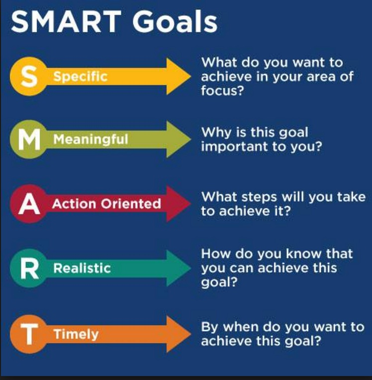

#  Experimental Design and Pandas
DS | Lesson 2

### LEARNING OBJECTIVES
*After this lesson, you will be able to:*

- Apply the data science workflow in the pandas context
- Write an iPython Notebook to import, format and clean data using the Pandas Library

### STUDENT PRE-WORK
*Before this lesson, you should already be able to:*

- Create, open and create and iPython Notebook
- Have completed python pre-work

### LESSON GUIDE
| TIMING  | TYPE  | TOPIC  |
|:-:|---|---|
| 5 min  | [Opening](#opening)  | Lesson Objectives  |
| 10 min | [Demo](#demo2)  | Walkthrough Acquire and Parse with Pandas |
| 1 hour | [Codealong](#codealong)  | Pandas Intro |
| 5 min  | [Introduction](#introduction3)  | Lab Walkthrough  |
| 40 min  | [Independent Practice](#lab)  | Lesson 2 lab |
| 10 min  | [Conclusion](#conclusion)  | Review lab and lesson objectives |
| 15 min  | [Wrap-up](#wrapup)  | Unit 1, project, where we're headed |

---

## Slides are [here](./assets/slides/02-experimental-design-and-pandas.pdf)

Additional resources:

* [Sample data dictionary](./assets/slides/data_dictionary_trip_records_yellow.pdf)
* [Git training](./assets/slides/02_git.pdf)
* [Sample buisness question](./assets/slides/TEXATA-2015-Round-2-Case-Study-Information.pdf)

## Opening (5 min)

- Review Current Lesson Objectives
    - Review Data Science workflow
    1. Identify
    2. Acquire
    3. Parse
    4. Mine
    5. Refine
    6. Build
    7. Present

Today we will focus on steps 2-3, and we will dive into steps 3-5 over the next few classes.

## Intro: Asking a good question (10 mins)

#### Why we need a good question/aim
"A problem well stated is half solved."

By having a high quality question/aim you set yourself up for success as you being your analysis. You also establish the basis for making your analysis reproducible. A clearly articulated research question not only helps other data scientists learn from, and reproduce your work, but also helps them expand on your work in the future.

#### What is a good question?
The goals of a high quality, reproducible question are similar to the SMART Goals Framework.

- S: specific
- M: measurable
- A: attainable
- R: reproducible
- T: time-bound

Let's break this down further:

1. Specific: The dataset and key variables are clearly defined.
2. Measurable: The the type of analysis and major assumptions are articulated.
3. Attainable: The question you are asking is feasible for your dataset and is not likely to be biased.
4. Reproducible: Another person (or you in 6 months!) can read your state and understand exactly how your analysis is performed
5. Time-bound: You clearly state the time period and population for which this analysis will pertain

## Data science workflow: Acquire & Parse (5 mins)

During this section we are going to walk through key features of steps 2 & 3 of the data science workflow. We will be working with an iPython Notebook. I'll demo the steps first, then we will try them together. During the last part of class, you will try your hand at the steps individually.

## Demo: Walkthrough Acquire and Parse with Pandas (30 mins)

#### Acquire
You'll remember from the previous class that the "Acquire" step is where we determine if the dataset we have is the "right" dataset for our question.

One factor is what type of data is it: Cross-sectional? Longitudinal/Time Series? The next question is how well was the data collected? Does it have a ton of missing data? Was the instrument used to collect the data validated and reliable? Is this dataset aggregated? Can we use the aggregation or do we need to get it pre-aggregation?

#### Logistics of acquiring your data
You can access data through a variety of different methods, including:
1. Web (Google Analytics, HTML, XML)
2. File (CSV, XML, TXT, JSON)
3. Databases (SQL, no-sql, etc)

Today will be using a CSV (comma separated value) file in our lab.

#### Parse- Understanding your data
Before and after you acquire your data, you also want to make sure you understand what data you've collected. This ensures that you've collected the *right* data and helps you figure out how it can be used. To better understand your data, there are a number of steps you might follow:

- Create or review the data dictionary
- Perform exploratory surface analysis via filtering, sorting, and simple visualizations
- Describe data structure and the information being collected
- Explore variables and data types via select

#### Intro to data dictionaries and documentation
Data dictionaries are often our primary source to help judge the quality of our data and also to understand how it is coded. If our gender variables are coded 0 and 1, how do we know which is male and which is female? Your data dictionary! Is your currency variable coded in dollars or euros? Data dictionary!

##### Data Dictionary Examples

Data dictionaries are also where you'll identify any requirements, assumptions, and constraints of your data. Note that you should never assume that a pre-existing data dictionary is complete. It is often going to be up to you to test your assumptions and add to your dictionary.

**Check:** What is a 'data dictionary' and what is it used for? Why?

## Codealong- Numpy and Pandas intro (30 minutes)
 
See [NumPy & Pandas notebook](./code/numpy-and-pandas.ipynb)

What is Numpy and Pandas?
Pandas is built on Python. In Numpy, we use arrays. With arrays you can do:

1. basic math.
2. splicing, indexing etc.

Pandas uses data structures that will look more familiar to folks who have used excel or other spreadsheet based tools. These are called **Dataframes**. A Dataframe contains rows and columns.

Similarly, you can select pieces of data, do basic operations, and calculate summary statistics. Let's see some examples:

Additionally, we often have to merge data together, correct missing data, and plot our findings. Let's see some examples of each of these:

**Check:** What is a 'dataframe' and when would you use one?

## Lab Walkthrough (5 min)

This lab is based on a quiz given in Roger Peng's "Computing for Data Analysis" class on Coursera. During the lab you will read in and merge two datasets "ozone" and "data". By the end of the lab, you will:

1. Merge datasets
2. Check basic features, such as column names, number of observations
3. Find and drop missing values
4. Find basic stats like mean & max (more on these next time!)

The purpose of this lab is to get some practice working with Pandas. We will dive into stats more next week.

## Lesson 2 Lab (20 min)

## Conclusion (10 mins)

- Review solutions & questions from lab
- Review objectives from class

Generate a list of the major takeaways

## Unit 1, project, where we're headed (15 mins)

- Review Unit 1 objectives
- Introduce the first project
- Exit tickets

***

### Additional Resources

Name | Description
--- | ---
[Official Pandas Tutorials](http://pandas.pydata.org/pandas-docs/stable/10min.html) | Wes & Company's selection of tutorials and lectures
[Julia Evans Pandas Cookbook](https://github.com/jvns/pandas-cookbook) | Great resource with examples from weather, bikes and 311 calls
[Learn Pandas Tutorials](https://bitbucket.org/hrojas/learn-pandas) | A great series of Pandas tutorials from Dave Rojas
[Research Computing Python Data PYNBs](https://github.com/ResearchComputing/Meetup-Fall-2013/tree/master/python) | A super awesome set of python notebooks from a meetup-based course exclusively devoted to pandas
